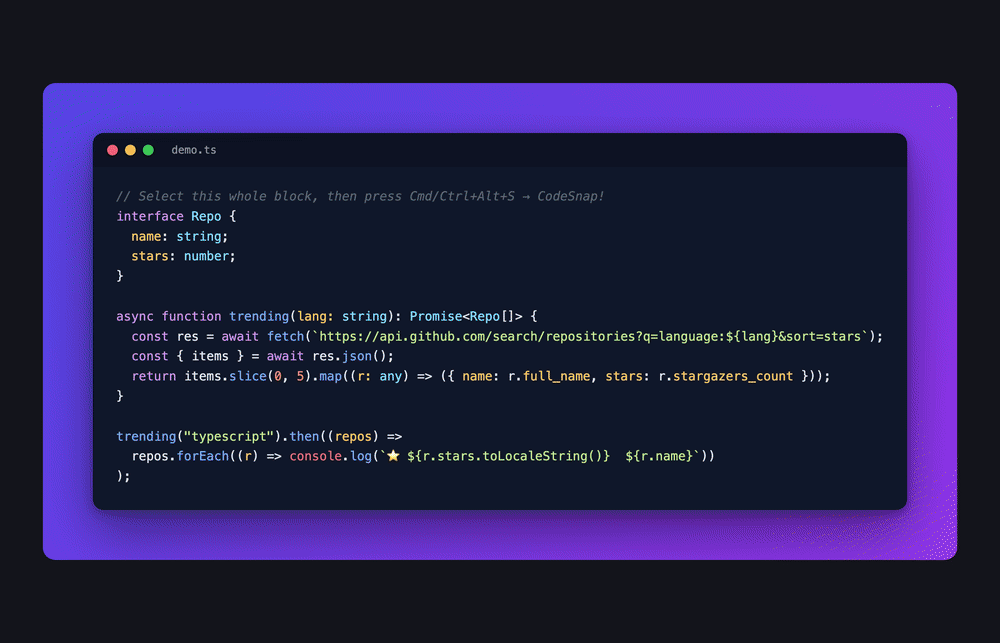

# CodeSnap

Turn any code selection into a **beautiful, shareable image** — without leaving your editor. Free and open source.



## Why
Developers share code screenshots constantly — on X, in blog posts, in docs and PRs.
Today that means copy/pasting into a separate site like Carbon or ray.so. CodeSnap does
it **inline**: select code → get a gorgeous image → copy or save in two clicks.

## Features
- 🎨 9 hand-tuned themes — Midnight, GitHub Dark, Dracula, Tokyo Night, Nord, Synthwave, Aurora, Ember, Paper
- 🌈 Separate **backdrop** picker (gradients) + **Transparent** for clean PNG cut-outs
- 🔤 Font + size controls, adjustable padding, optional line numbers
- 🪟 macOS-style window chrome (toggle on/off)
- 🎲 **Surprise** button to randomize the look
- 📋 One-click **copy to clipboard** (paste straight into a tweet)
- 💾 **Save PNG** up to 4x for crisp retina output
- 🔒 100% local — your code never leaves your machine. No account, no telemetry.

## Install
Search for **CodeSnap** in the Extensions view of VS Code or Cursor, or install it from
[Open VSX](https://open-vsx.org/extension/nullmesh/codesnap).

## Usage
Select some code → right-click → **CodeSnap: Capture Selection as Image** (or press
`Cmd/Ctrl+Alt+S`). Adjust the look in the panel, then **Copy** or **Save PNG**.

## Contributing
```bash
npm install
npm run watch
# then press F5 in VS Code / Cursor → "Run Extension"
```
Issues and PRs welcome.

## License
MIT © Null Mesh
